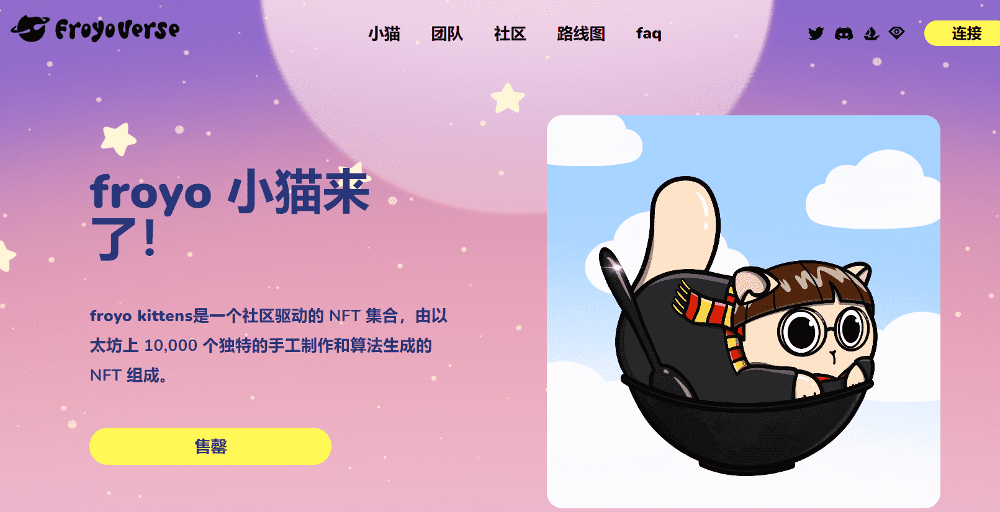

# froyo kittens

froyo kittens 是由 jessie morii 手绘和创作的系列。

froyo 小猫美学的组合是根据 444 种手绘特征定制生成的，因此每只小猫都是独一无二的，并且由 100% 的爱和可爱的点缀制成！

froyo kittens是一个社区驱动的 NFT 集合，由以太坊上 10,000 个独特的手工制作和算法生成的 NFT 组成。

有 10 只独一无二的 froyo 小猫被 jessie 磨砂，它们不与任何其他 froyo 小猫分享它们的特征。

4 月 8 日至 9 日是我们的喵喵薄荷活动，从 UTC 时间 0000 开始，我们的喵喵们有 48 小时的时间为他们的小猫薄荷糖。

4 月 10 日是我们的公共铸币活动，公众也可以铸币他们的小猫！

