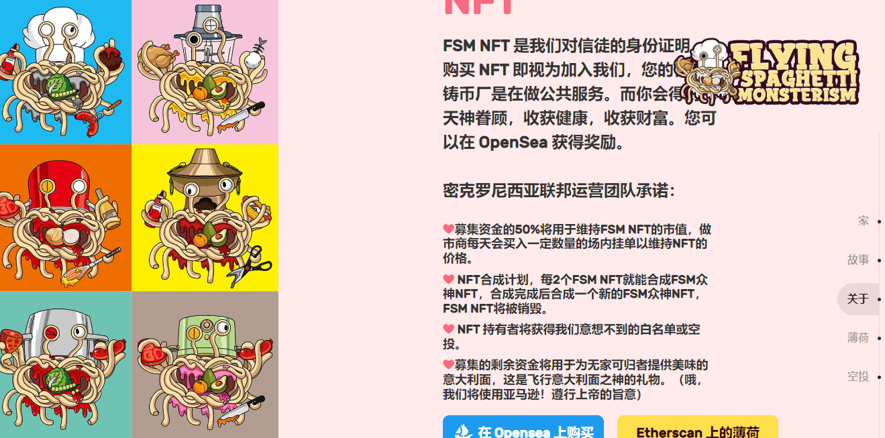

# Flying Spaghetti Monsterism

Flying Spaghetti Monsterism UN是由密克罗尼西亚联邦信徒组成的慈善组织，是密克罗尼西亚联邦的一个重要分支。该组织的核心是为无家可归者提供免费意大利面，我们需要更多的支持者。如果您想了解更多关于 FSM 的信息，请在 Google 上搜索我们。飞行意大利面崇拜于 2005 年 6 月由预言家和俄勒冈州立大学物理专业毕业生鲍比·亨德森创立，他认为宇宙是由一个会飞的意大利面怪物在严重酗酒后创造的，而这个意大利面怪物是唯一的真神。

