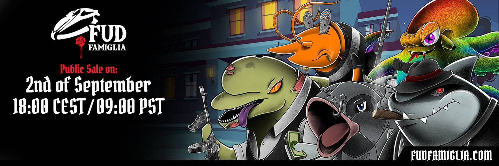

# FUDFamiglia

海洋最臭名昭著的家族。10.000 个水生黑手党同伙，6 个不同的类别，全部随机生成并存储在 IPFS 中。

10.000 UNIQUE AQUATIC NFT，具有独家福利、游戏、赠品和实用程序。

▶ 什么是FUDFamiglia？
FUDFamiglia 是一个 NFT（不可替代代币）集合。存储在区块链上的数字艺术品集合。

▶ 有多少FUDFamiglia代币？
总共有 10000 个FUDFamiglia NFT。目前，142 位车主的钱包中至少有一个 FUDFamiglia NTF。

