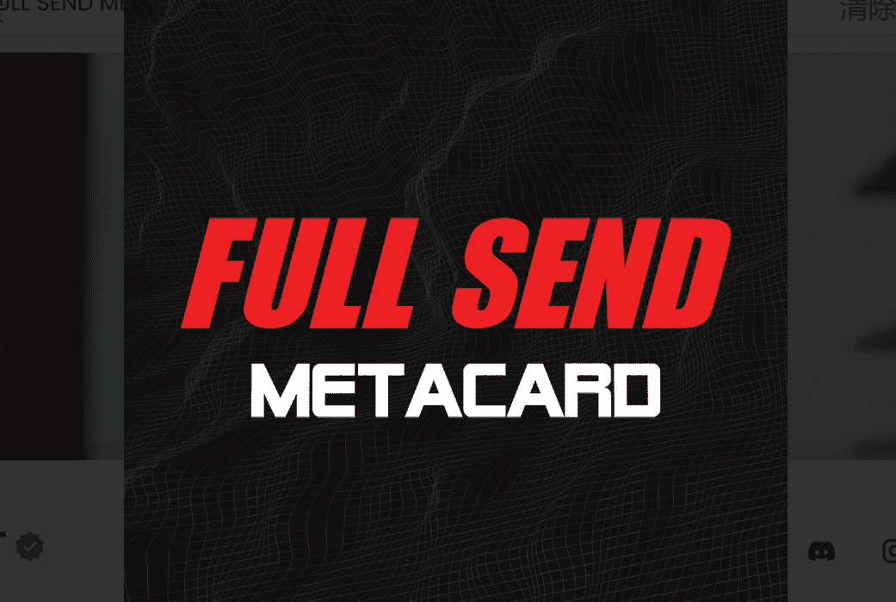

# FULL SEND METACARD V2

项目网站、社交联系方式、项目介绍内容详见：

FULL SEND METACARD 建立在以太坊区块链上，供应有限的 10,000 个 NFT，可让您访问 FULL SEND 和 NELK 帝国。FULL SEND METACARD NFT 是一个 NFT（Non-fungible token）集合。存储在区块链上的数字艺术品集合。

总共有 9,999 个 FULL SEND METACARD NFT NFT。目前，7,040 位所有者的钱包中至少有一个 FULL SEND METACARD NFT NTF。

