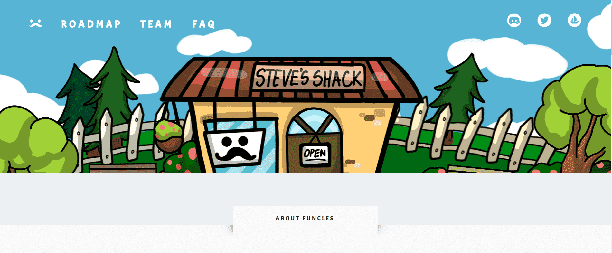

# Funcles NFT

Funcles(Fun-Uncles) 是一个 GENESIS 集合，包含 3333 个生活在以太坊区块链上的独特功能。他喜欢玩乐，享受生活，并培养他的邪恶莫来支持Movember。

加入我们支持男性健康的冒险，探索 web3 革命，同时与我们的朋友一起创造有意义的回忆。

Funcles 的艺术作品展示了男性身体和精神健康的真实性和挣扎。男性的健康不仅仅是拥有肌肉发达的体质——它还关乎平衡健康的生活方式和保持健康的思维空间。有了爸爸的身体，我们希望在保持健康习惯的同时，正常化和促进对不同自然体型的接受。他还留着 Movember 小胡子，象征着他对男性健康运动的支持。Funcles 致力于在我们的涂料生态系统中创建一个社区。

