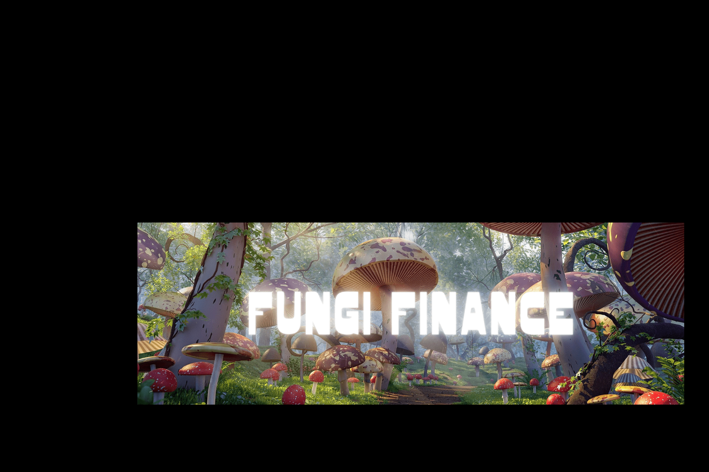

# Fungi Finance

Fungi Finance - 币安智能链 (BSC) 上的下一代 DeFi 交易所*Fungi Finance* - 币安智能链 (BSC) 上的下一代 DeFi 交易所。#6414。一般来说。#1481 在 DeFi 中。#2217。在 BNB 链中。图库索引 0。*Mushrooms Finance*是另一个加密货币收入库，专注于在 DeFi 世界中寻求可持续的利润。*Mushrooms Finance*是另一个加密货币收入库，专注于在 DeFi 世界中寻求可持续的利润神奇”*蘑菇*含有裸盖菇素和 LSD——最初来自麦角，一种生长在黑麦上的*真菌*——被一些人认为具有真正的.我们最终在这里宣布关闭 Mushrooms Finance，感觉非常糟糕。这一最终决定是在仔细考虑当前项目状态和宏观市场状况后做出的。

维护一个多链收益聚合平台以获得可靠收益从来都不是一件容易的事。到目前为止，团队已经为这个项目的开发付出了一切，但最终我们发现，实现我们两年前开始时最初预期的机会已经消失了。

