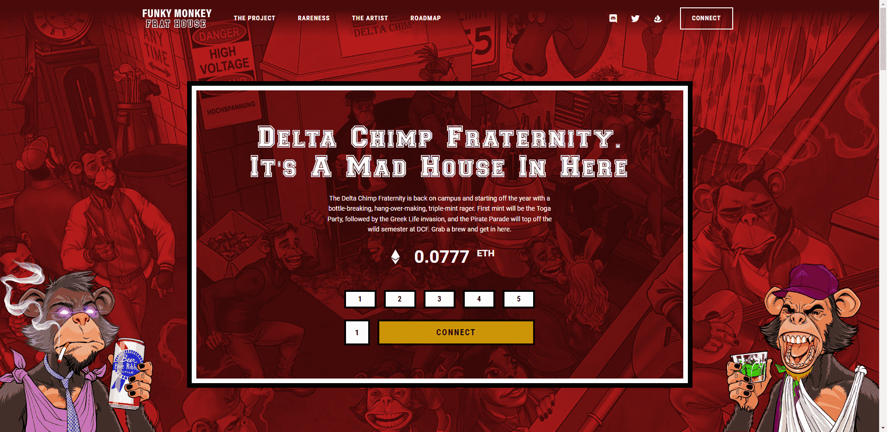

# Funky Monkey Frat House

FMFH 旨在成为艺术家的艺术家社区。无论他们是年轻人还是老年人，加密货币新手，熊市老手，或者只是美术收藏家。欢迎任何想参与社区学习和协作，或者只是与其他行业人士闲逛和聊天的人。对于饥饿的艺术家来说，这是一个艰难的世界，但通过区块链和 NFT 的发明和创新，前方有一个新的曙光……我们希望你成为其中的一部分。

Genesis Customs (502 Max) - Genesis Customs 是开始这一切的 1/1 系列！这些由创始人 Mike S Miller 或客座艺术家/艺术猴子委托制作的作品不仅展示了令人难以置信的艺术，而且在该项目中具有最高的实用性。它们是随着佣金的到来而创建的，价格会随着佣金的增加而上涨，并且该系列将以 502 收盘！

东加派对！（1000 枚薄荷）- Generative Funky Monkey Frat House 3k 系列中的第一枚薄荷真正拉开了派对的序幕！他们为首次采用者提供了独特的 toga 属性，作为可暂停智能合约铸币厂的概念证明，并导致了 251 枚铸币错误的 BAD MONKEYS（它们生活在寒冷中）。有了这些铸币，我们不仅在不和谐中继续定期赠品，而且还推出了我们的季度“兄弟会派对”，在 YouTube 上直播，奖品包括 NFT 和甜蜜的加密货币！

