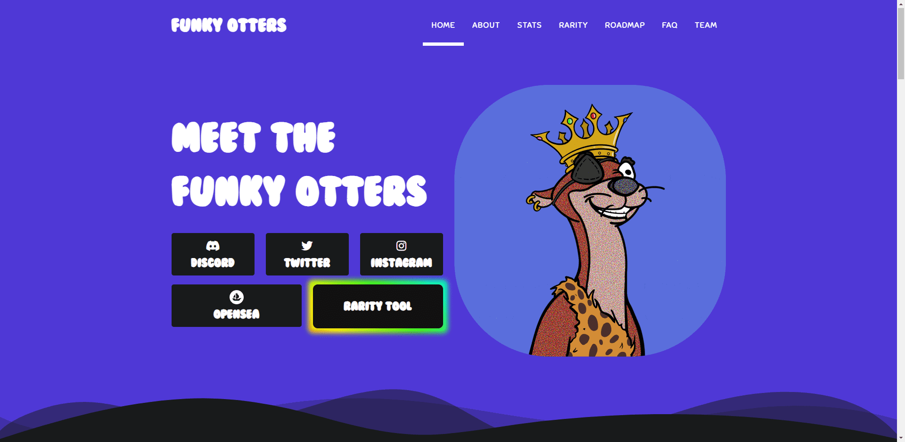

# Funky Otters

水獭厌倦了生活在湖泊和河流中，这就是为什么它们决定搬到城市与人类一起生活。虽然水獭觉得人类的生活方式很奇怪，但他们非常喜欢互联网。在互联网上花费了太多时间（尤其是在 reddit 上）之后，他们变成了极客，并决定永远与人类生活在一起。

如果您想通过查看图片来分析最稀有的特征，而不是在 Opensea 上，我们的稀有图可能正是您正在寻找的。

在这张图表上很容易找到最稀有的作品，其中充满了 180 多种创意特征。

Mythic、Legendary、Epic、Rare 类别下的特性可以被认为是该系列中最稀有的物品。

