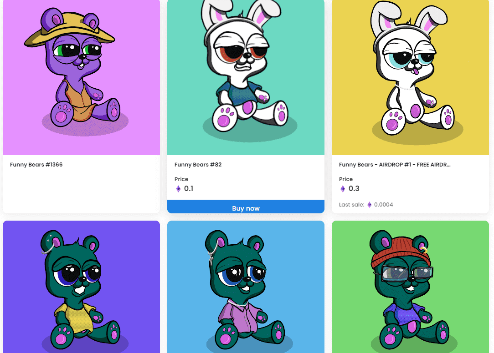

# Funny Bears Collection

我们是 5000 个独特个体的部落。

我们生活在由 ERC-721 喂养的多边形丛林中。

我们很有趣，但不要忘记我们是狂野的！

什么是有趣的熊系列？

有趣的熊系列是一个 NFT（非同质代币）系列。存储在区块链上的数字艺术品集合。

有多少有趣的熊收藏代币？

总共有 2,504 个搞笑熊系列 NFT。目前，3,194 位所有者的钱包中至少有一个有趣的熊系列 NTF。

最昂贵的搞笑熊系列促销活动是什么？

售出的最昂贵的 Funny Bears Collection NFT 是 Funny Bears #159。它于 2022-08-23（6 天前）以 4.5 美元的价格售出。

