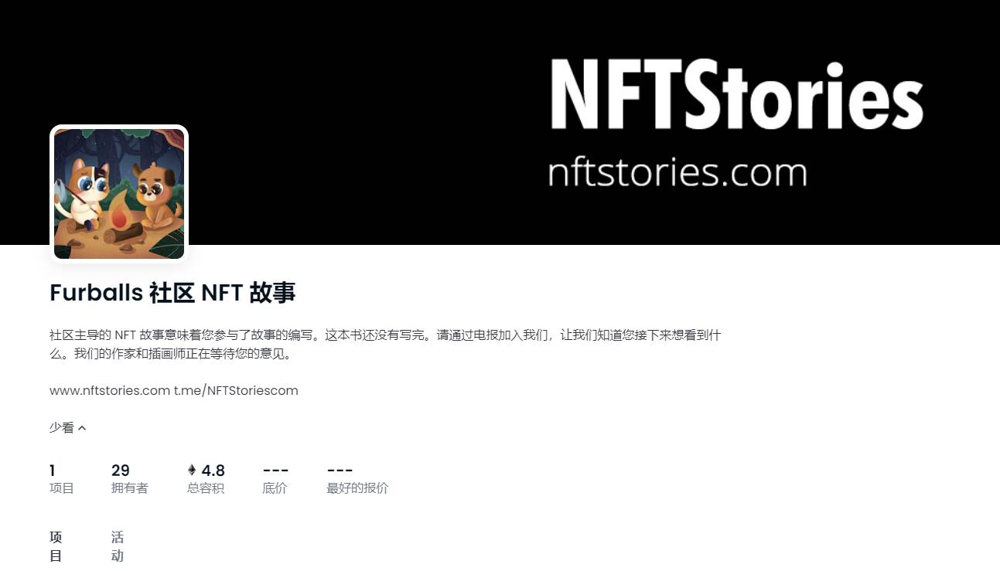

# Furballs A Community NFT Story

发布平台，让任何人都可以通过#NFT 区块链技术讲述甚至出售自己的$STORY 。

发布平台，让任何人都可以通过#NFT 区块链技术讲述甚至出售自己的$STORY 。

“好吧，至少现在我不必闻湿猫毛了，”狗诺克说。

“嘘，你，”哈鲁回答说，猫发出嘶嘶声。“我们一开始就陷入这种混乱是你的错，别以为我会让你忘记这一点！”

噼啪作响的火和它可爱的温暖是很长一段时间以来发生在他们身上的第一件美好的事情。他们已经在 Vegal 森林里跋涉了好几个小时了，他们的小爪子都起了水泡和酸痛，所以坐下来也是一件好事。他们齐声叹息，迷失在舞动的火焰中。

“你在那个面包车里有食物吗？” 诺克狂吠。

“只有猫粮，”Haru 喵喵叫，然后软化了。“但我愿意分享。”

风吹过，吹动了树木。沙沙作响的树枝把头发竖了起来。他们周围茂密的黑暗树林中的每一次裂痕和吱吱声都让他们跳了起来。他们如坐针毡，如果你经历过这两个前敌人刚刚经历过的事情，你也会如此。

“我很害怕，Nok，”猫哈鲁说，泪眼婆娑。

“我也是，哈鲁，”狗诺克回答。“但是，就其价值而言，至少我们并不孤单。”

今晚，迷失在树林里，他们不仅仅是一只狗和一只猫。

他们是兄弟。

