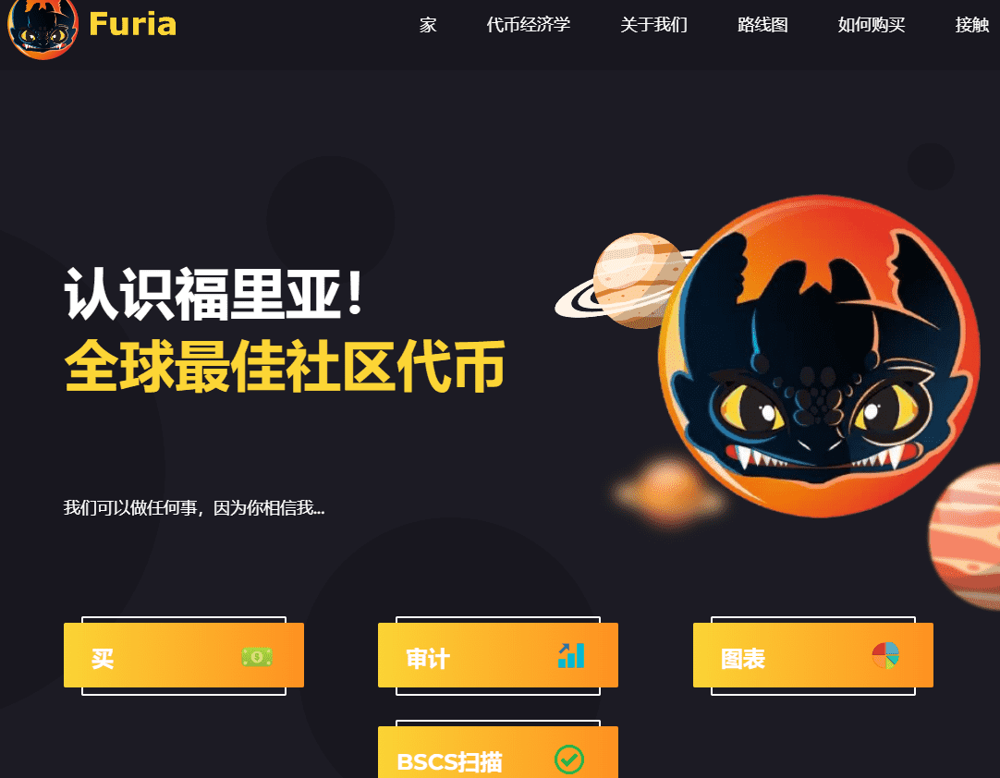

# FURIA.Finance

FURIA 是 BSC 上的 Needed 慈善代币之一。每笔交易都有 5% 的自动流动性协议和 5% 的再分配协议来保护持有者。这种协议配对随着时间的推移增加了每个持有者的投资价值。但关键区别在于，团队将使用他们在交易税中的份额直接捐赠给需要的人！每笔交易的 5% 被提取并重新分配给所有 Furia 持有者。只需购买、持有和赚取。每笔交易都有 2% 的消耗。每 1000 个持有者，将有 1 万亿个代币被销毁。这有助于减少波动性和不断提高的价格下限。Furia 是一种慈善代币。每个月，Furia 都会将部分利润捐给慈善机构。

