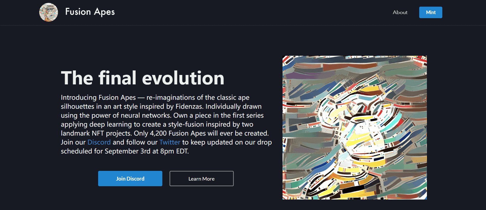

# FusionApes

Fusion Apes 简介——以受 Fidenzas 启发的艺术风格重新想象经典猿剪影。使用神经网络的力量单独绘制。在第一个系列中拥有一篇应用深度学习创建风格融合的作品，灵感来自两个具有里程碑意义的 NFT 项目。只有 4,200 只融合猿会被创造出来。加入我们的[Discord](https://discord.gg/zrcHuuBDc7)并关注我们的[Twitter](https://twitter.com/fusionapes)，以随时了解我们定于 9 月 3 日美国东部时间晚上 8 点发布的最新消息。

每个 Fusion Ape 都是使用 Gatys 等人开创的基于卷积神经网络的算法单独生成的。Fidenza 风格，包括颜色、纹理和笔触，被针对 NFT 艺术性优化的修改后的 VGG-19 算法用作灵感。

