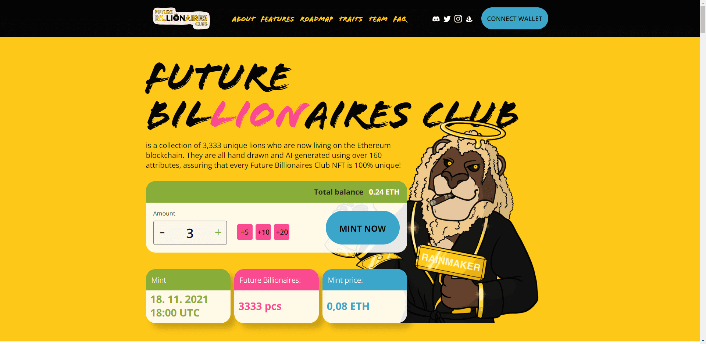

# Future Billionaires Club Original

是 3,333 只独特的狮子的集合，它们现在生活在以太坊区块链上。它们都是手绘并使用 160 多个属性由 AI 生成，确保每个 Future Billionaires Club NFT 都是 100% 独一无二的！

每个人都知道狮子是丛林之王，对吧？但为什么？狮子因其原始的力量和力量而成为国王。狮子不惧怕其他动物，它们的骄傲使它们更加强大。拥有一头狮子意味着您是骄傲的一部分，这使您可以获得许多独家福利。世界是我们的丛林，我们将一起追逐和追捕每个角落的成功，作为宇宙中最大的狮子骄傲！

Future Billionaires Club 是以太坊区块链上独特的、随机生成的 NFT 的集合，即 ERC-721 NFT。这些图像将托管在 IPFS（星际文件系统）上，以便它们永远与我们同在！

