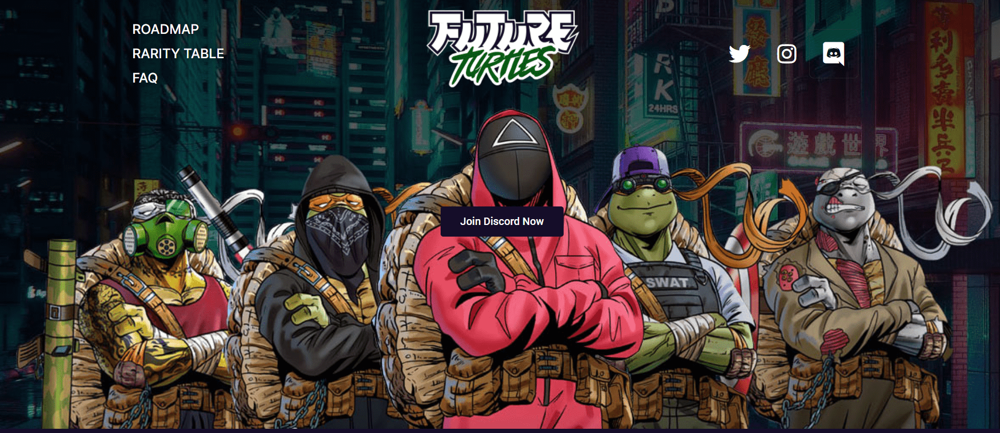

# Future Turtles - Genesis

Future Turtles 是具有 4 个不同角色的数字全身艺术收藏。每个 NFT 都是独一无二的。

现在是 2055 年，加密货币已经超越了整个金融系统。由于政府失败，未来海龟世界的内战爆发了。现在每只乌龟都需要生存并拥有自己的武器来为自己的自由而战。在这次首发中，海龟们需要您的最后支持才能完成他们的计划。铸造一个，你免费一个。所以所有铸造的海龟都可以成功逃脱。

Future Turtles 是一个以社区为重点的衍生 NFT 集合。每个 Future Turtles NFT 都是使用 110 多种属性（如武器、眼睛、皮肤等等）的组合通过算法生成的！Future Turtles NFT 在以太坊 (ETH) 区块链上推出，旨在以可承受的价格提供高质量的艺术品，同时执行广泛的路线图。

