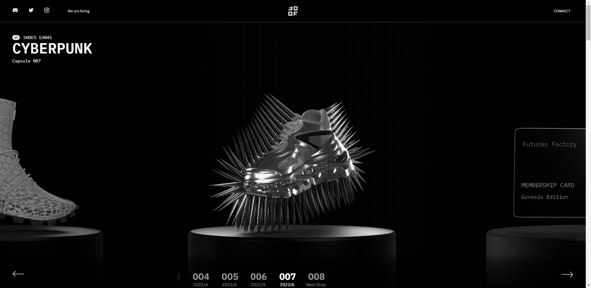

# FF - Membership Card - Genesis Edition

Futures Factory 是一个创新的组织，在运动鞋文化和创造者经济的最前沿运作。

我们万无一失的 NFT 平台使运动鞋设计师和独立品牌能够将他们的创作作为与尖端和有趣实用程序相关的不可替代代币出售。

我们在这个领域进行的实验为融合数字世界和物理世界铺平了道路，开创了运动鞋行业的新时代。

您将能够收集、在视频游戏中玩、使用 AR 显示在您的脚上或以 3D 打印的虚拟运动鞋。“ Futures ”运动鞋将由 NFT 的所有者实际制造并可供赎回。

通过为他们创造新的机会让他们相互见面和协作、分享他们的技能、与他们的受众建立联系并产生新的收入来源。

品牌可以在开始生产之前销售期货（由实体运动鞋支持的 NFT）。时尚行业需要更多“需求驱动”的模式。

