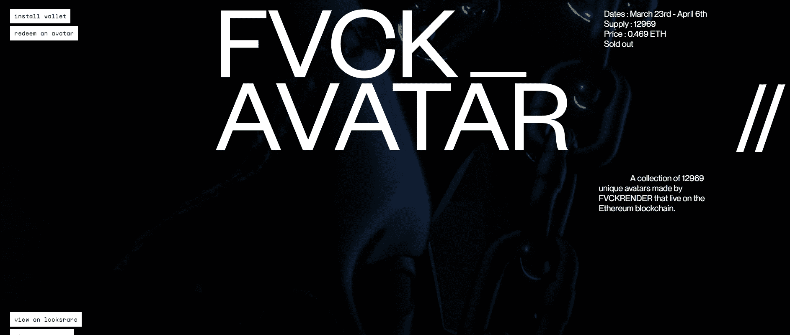

# ESSENCE//

由 FVCKRENDER 制作的 12969 个独特头像的集合，这些头像存在于以太坊区块链上。

不是典型的 PFP 项目，Fvck_Avatars 是 3D 收藏品，在 Fvckrender 正在构建的生态系统中具有固有的实用程序。

这个项目中封装了 FVCKRENDER 在过去 10 年的工作中开发的元素。随着新元素的添加，化身被设计为与 FVCK_CRYSTALS 共存并充当 LVCIDIA 中的信标。

Fvck_Avatar 将使用名为 ESSENCE// 的赎回令牌分 4 个阶段启动。

