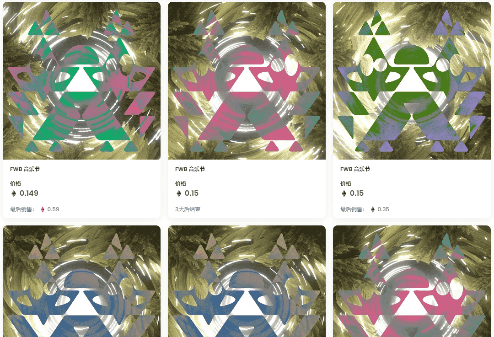

# FWB FEST

FWB FEST是由 FWB 社区策划和制作的文化和 Web3 交汇处的沉浸式会议和节日体验。该节日将于 2022 年 8 月 12 日至 14 日在 Idyllwild 艺术学院举行。每个 NFT 代表一张节日门票。在此处注册您的门票以确认您的出席。

什么是 FWB FEST？

FWB FEST 是一个 NFT（不可替代代币）集合。存储在区块链上的数字艺术品集合。

有多少 FWB FEST 代币？

总共有 291 个 FWB FEST NFT。目前，286 位车主的钱包中至少有一个 FWB FEST NTF。

最昂贵的 FWB FEST 销售是什么？

出售的最昂贵的 FWB FEST NFT 是 FWB FEST #74。它于 2022 年 6 月 6 日（3 个月前）以 1.1 万美元的价格售出。

最近卖出了多少 FWB FEST？

过去 30 天内售出了 26 个 FWB FEST NFT。

FWB FEST 的费用是多少？

在过去 30 天里，最便宜的 FWB FEST NFT 销售额低于 549 美元，最高销售额超过 802 美元。FWB FEST NFT 的中位价格在过去 30 天内为 662 美元。

