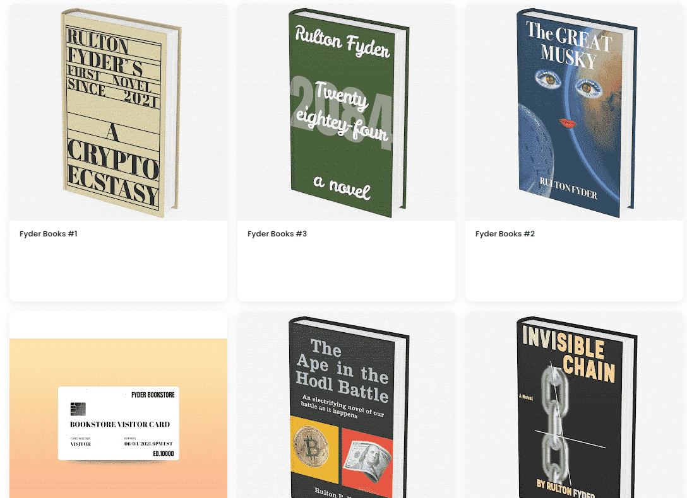

# Fyder Bookstore

Fyder 书店是 Rulton Fyder 的当代艺术项目。Fyder 书店将永远只存在 100 册 Fyder 书籍。每个为 1/1 NFT。要获得一本 Fyder Book

世界与扩张相连。人类已经将他们的代币放在了喜欢、评论和分享的每一个行为上。每一条信息，每一个字，每一张图片，每一个视频，每一点，都被出租和抵押，采样和重新采样。NFT 艺术是从无数文化中心提取的引文组织。与布瓦尔和佩库谢类似，我们指出了深刻的荒谬，这正是艺术的真理。艺术家们只能模仿一种总是在前的姿态，而不是原创的姿态。NFT 艺术家的超能力是将想法混合在一起，以一种从不依赖于任何一个的方式来对抗其他想法。通过这个过程，思想万花筒的新组合诞生了。我们不是图片一代，我们是 NFT 一代。

