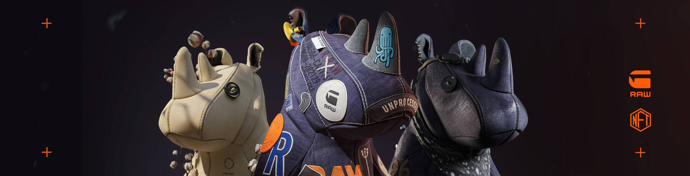

# G-Star RAW 3301 Community Token

G-Star RAW 3301 Community Token NFT - 常见问题（FAQ）
▶ 什么是 G-Star RAW 3301 社区代币？
G-Star RAW 3301 社区代币是一个 NFT（不可替代代币）集合。存储在区块链上的数字艺术品集合。
▶ 有多少个 G-Star RAW 3301 Community Token 代币？
总共有 1 个 G-Star RAW 3301 社区代币 NFT。目前，614 位所有者的钱包中至少有一个 G-Star RAW 3301 社区代币 NTF。
▶ 最昂贵的 G-Star RAW 3301 社区代币销售是什么？
售出的最昂贵的 G-Star RAW 3301 社区代币 NFT 是 G-Star RAW 3301 社区代币。它于 2022 年 6 月 14 日（2 个月前）以 88.5 美元的价格售出。
▶ 最近卖出了多少 G-Star RAW 3301 Community Token？
过去 30 天内售出了 20 个 G-Star RAW 3301 社区代币 NFT。
▶ G-Star RAW 3301 社区代币的价格是多少？
过去 30 天，最便宜的 G-Star RAW 3301 社区代币 NFT 销售额低于 28 美元，最高销售额超过 73 美元。G-Star RAW 3301 社区代币 NFT 的中位价格在过去 30 天内为 40 美元。
▶ 有哪些流行的 G-Star RAW 3301 社区代币替代品？
许多拥有 G-Star RAW 3301 Community Token NFT 的用户还拥有 G-NO Digital Art Collectibles、 Fantastic Alien ETH、 APE BANKING CLUB-NFT ABC METABANK和 Loser Ape Club Official。

