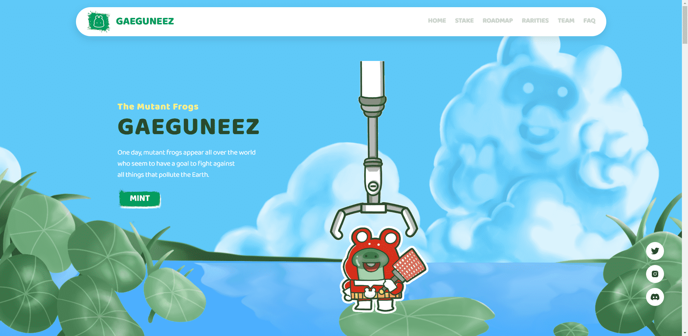

# Gaeguneez of the Planet

他们是保护环境免受各种污染物侵害的卫士。利用他们的变异力量，他们与困扰地球的污染者作战。

Doggies NFT 的 V2 铸币
即将推出。

由于宣布青蛙生态系统
的全面启动是一个
非常重要的事件，

简单介绍一下 Doggies 项目，

我们想花时间来看看Doggies
的宏观目标，很多人可能对此感到好奇。

我将根据我的主观想法和意见进行总体概述，

如果你能轻描淡写到“狗队是这样想的”的程度，我将不胜感激。

Doggie是融合
人物产业和环保产业的商业模式，是具有社会意的人物。它以保护环境
的社会小规模运动为主题。

你可以把它看成是为ESG打造的角色IP，在全球经济中已经成为时代的任务。这一点明显区别于现有角色行业的老式商业，只追求乐趣和刺激
来提高知名度。

