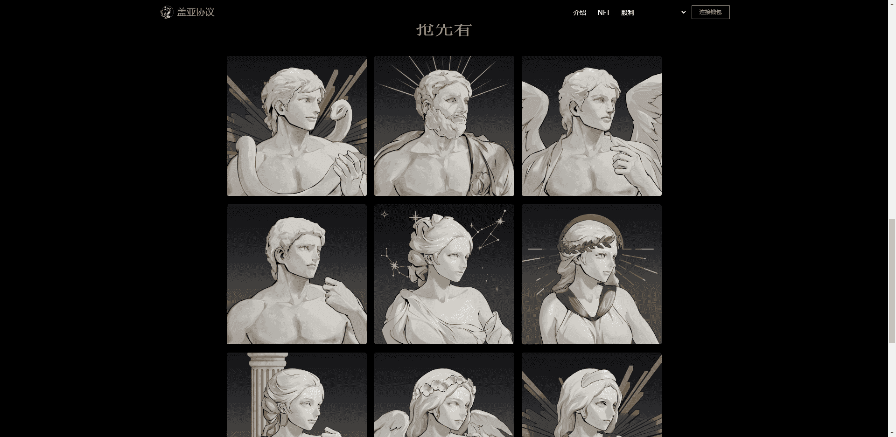

# Gaia Supernova

Gaia Protocol 是一个以投资为目的的 Klaytn 网络 PFP NFT 项目，结合了 Defi 2.0 和 NFT 概念。
Gaia Project 将尽可能地保护和支持投资者的本金。
NFT持有者将打造精致社区，成为NFT投资的枢纽。

该项目将所有铸造 Klay 的 50% 永久存放在 Kronos DAO 上，这是 Klaytn 网络上的第一个 Defi 2.0 计划。
存款产生的复利将分配给 NFT 持有者。
我们的使命是创建一个积极主动的社区，拥有 DeFi 2.0 和 NFT 投资的爱好者，为我们的社区成员提供信息交流和各种内部活动。

Gaia Protocol 将初始铸币量的 45% 作为回购基金运营，以保证投资者的投资本金。
这样，投资者就可以在没有投资损失压力的情况下参与铸币，随时通过盖亚网站申请回购。

