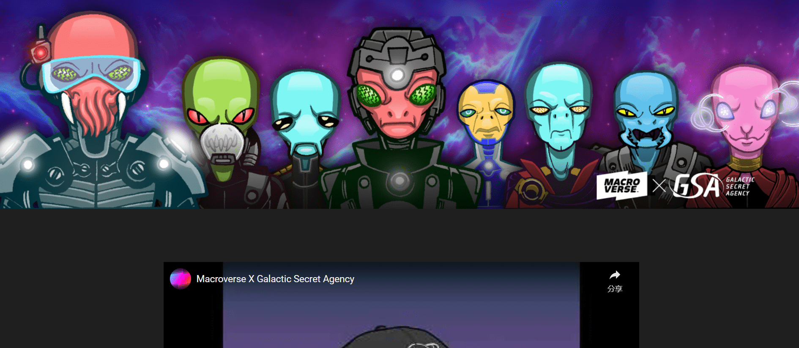

# Galactic Secret Agency

OG GSA 系列于 2021 年初铸造。10,000 个外星人的收藏很快售罄，并继续被 NFT 领域的许多先驱和早期采用者持有。对于许多人来说，这是他们的第一个 NFT。社区一直很喜欢这个项目。

但遗憾的是，最初的创作者没有继续这个项目。路线图被放弃了。该机构似乎迷路了！

幸运的是，收藏家罗宁介入并从遗忘的黑洞中拯救了这个项目。

这就是我们进来的地方。我们从俱乐部时代就认识浪人了。他知道我们正在建立一个 Web3 媒体工作室，并且想法开始流动。很快，合作诞生了，我们开始探索……

我们与社区合作，将 GSA 重新构想为一个成熟的娱乐特许经营权。我们开发了传说并且正在编写和制作第一个将来自它的项目。

我们正在建设。Macroverse 是一家Web3 娱乐组织，其创始人拥有 60 多年制作从电影和电视到游戏和漫画的所有内容的经验。

当我们与 GSA 社区合作时，很明显，最好的前进道路是将 GSA 完全融入我们正在构建的生态系统中。这使我们能够使用我们正在创建的所有工具和技术来扩展和增加收藏的价值。托管代理总是很重要的。

事情将在 2022 年完成。第一个是传说的插图版本，它为原始系列、全新的阿凡达系列、Epic NFT 漫画等的新的和扩展的未来奠定了基础。随着 Macroverse 将这艘火箭飞船带入一个新的未来，最初的收藏者、收藏品和社区将永远是核心

到我们如何移动和扩展。如果是你，我们想认识你。我们想与您合作。我们想和你一起建立这个。

