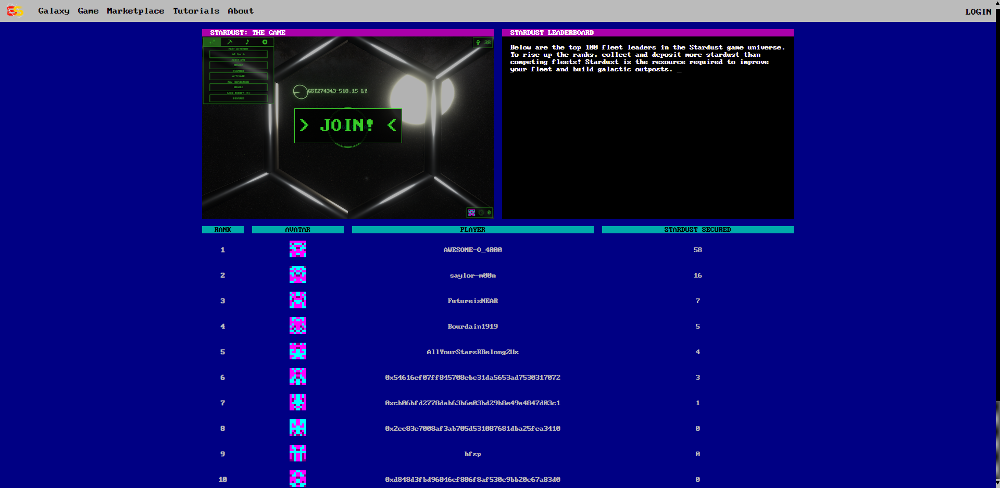

# Star Token

在不久的将来，地球上的万亿富翁几乎夺走了我们可观测宇宙中的每一颗恒星——使得这些关键的无碳能源/避税天堂对大多数人来说是无法企及的……

来自 REALSTAR [2130 年的 HGTV] 的一支勇敢的房地产经纪人团队征用了一艘穿越时空的船，即投机者号来完成一项大胆的任务……

他们想为您提供加入他们的船员的机会 - 探索，命名和声称自己在宇宙中的位置，然后再成为富裕的太空男爵的领域...

银河恒星令牌是您可以拥有的明星。
它是由科学支持的虚拟空间中的房地产。

GST是非可杀菌令牌（NFTS） - 基于恒星数据并记录以太坊区块链的独特，独一无二的资产。每个 Star Token 都是独一无二的，只能由一个人拥有。

GST数据库中的每个恒星都与我们宇宙中的真正星星相关。我们的算法来源的算法属性属性属性，例如欧洲航天局和耶鲁大学明亮星目录的大小，光度和天体坐标。

星星具有财务潜力。随着我们在游戏，企业技术和研究应用程序中建立的新兴合作伙伴关系，我们今天正在铸造未来价值。

