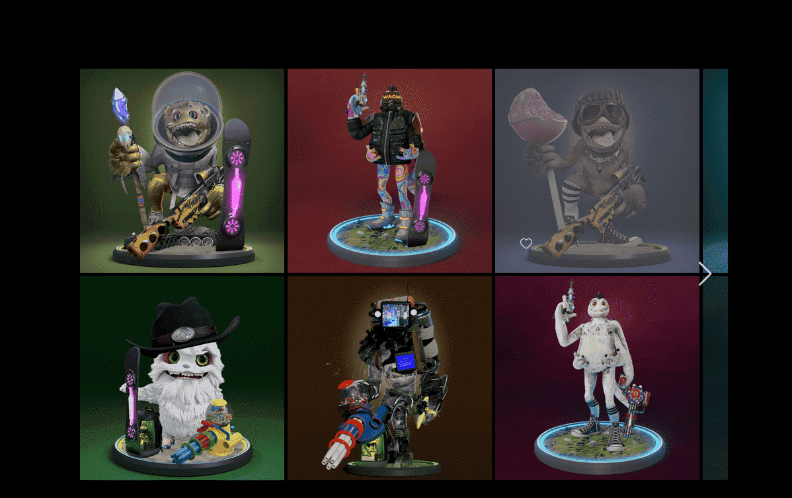

# Galaxii Online Tribes

Galaxii Online 是一组 5 个部落，灵感来自团队对收集神奇宝贝卡片的热爱。

我们开始寻找最好的艺术家——我们找到了他们！来自《辛普森一家》、《全家福》、《刺客信条》的艺术家，以及来自第 10 季《堡垒之夜》的皮肤开发人员齐聚一堂，在虚拟世界中展示他们的技能。

12 个月以来，我们一直在手工设计和建模 3D 角色及其资产。 

然后，我们以编程方式生成随机化以确保不创建重复项。

在成立之初，我们的团队就认识到 NFT 领域缺乏实用性。

 Galaxii Online 旨在为投资者和游戏玩家提供与实用程序相结合的高质量产品。

 我们的团队了解到，一些收藏家更愿意持有他们的代币而不参与游戏化方面，而另一些收藏家则非常致力于在游戏生态系统中投入时间。该项目旨在满足这两个需求。

“现在是 2085 年，地球变得无法居住。随着臭氧层枯竭、气温上升和食物稀缺——人类前往太阳系并开始寻找新的家园。系统故障迫使飞船降落在他们称为ERC-X；一个既酷热又低于零温度的行星。

抵达后，他们开始寻找殖民地点；完全没有意识到鸡蛋，都以自己的方式独一无二，位于两种极端天气模式的交汇处。

他们并不孤单……”

