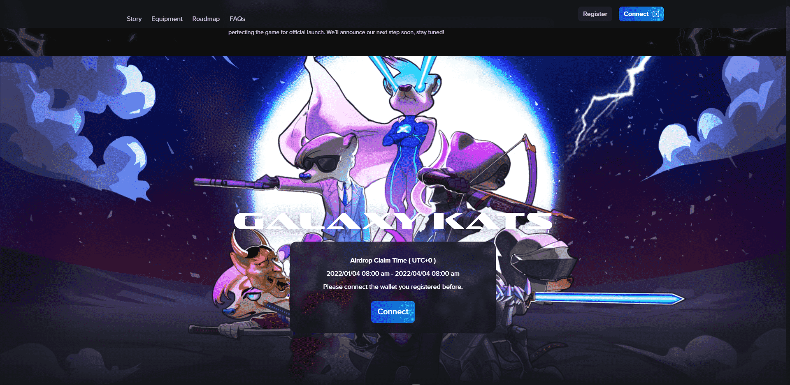

# GalaXY Kats Vault

GalaXY Kats 是以太坊区块链上 10,000 个独特的猫鼬 NFT 的集合。每个猫鼬都是持有者的头像和进入区块链游戏 GalaXY Kats 的门票。此外，持有者可以参与独家内容空投并获得代币。

2140年，传染病破坏了环境的稳定；它正在慢慢地使地球变得不适合居住。科学家们不得不发现另一个“地球”，以避免地球上所有生命的灭绝。多年后，一个 10 人的团队抵达了一个有着无尽沙地的星球。他们称它为Harena。不幸的是，科学家们确定 Harena 不适合人类殖民。没有足够的燃料，他们无法返回地球。因此，幸存的 10 人决定将他们的意识传送到唯一可以在这种情况下生存的生物——猫鼬。

500年后，猫鼬继承了人类的意志，进化成了这个宇宙中最优秀的智慧生物。一个文明建立在哈雷娜和其他五个相邻的星球上。他们称自己为 - Galaxy Kats。

GalaXY Kats在继承人类意识之初就培养了“再生人类”的理念。然而，除了少数始祖猫鼬，其他人都逐渐忘记了人性。有一天，会诞生一只猫鼬，它会重新点燃这个愿景、这个使命、这个命运！

收养猫鼬，拯救人类。

