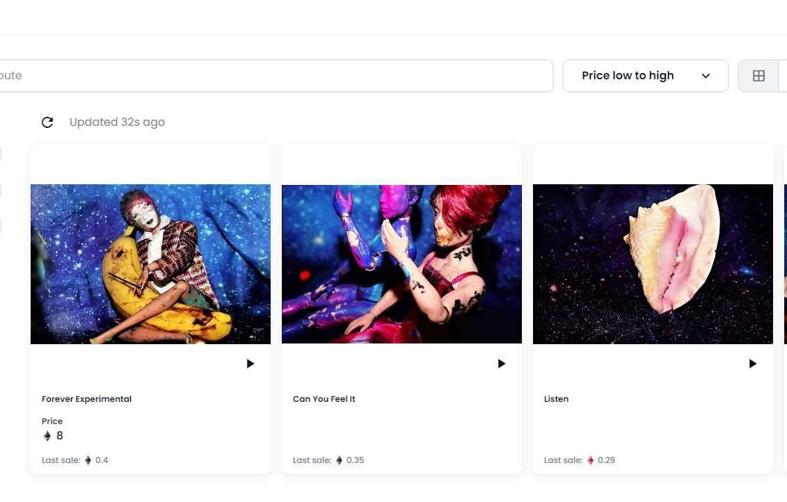

# Galaxy Series 111

一系列定格动画短裤，给人一种不舒服、超现实的感觉。由黛安·林多创作。

什么是 Galaxy Series 111？

Galaxy Series 111 是一个 NFT（非同质代币）系列。存储在区块链上的数字艺术品集合。

有多少 Galaxy Series 111 代币？

总共有 4 个 Galaxy Series 111 NFT。目前 4 位所有者的钱包中至少有一个 Galaxy Series 111 NTF。

Galaxy Series 111 最贵的促销是什么？

售出的最昂贵的 Galaxy Series 111 NFT 是 Can You Feel It。它于 2022 年 6 月 21 日（2 个月前）以 384.2 美元的价格售出。

最近卖出了多少 Galaxy Series 111？

过去 30 天内售出了 3 个 Galaxy Series 111 NFT。

