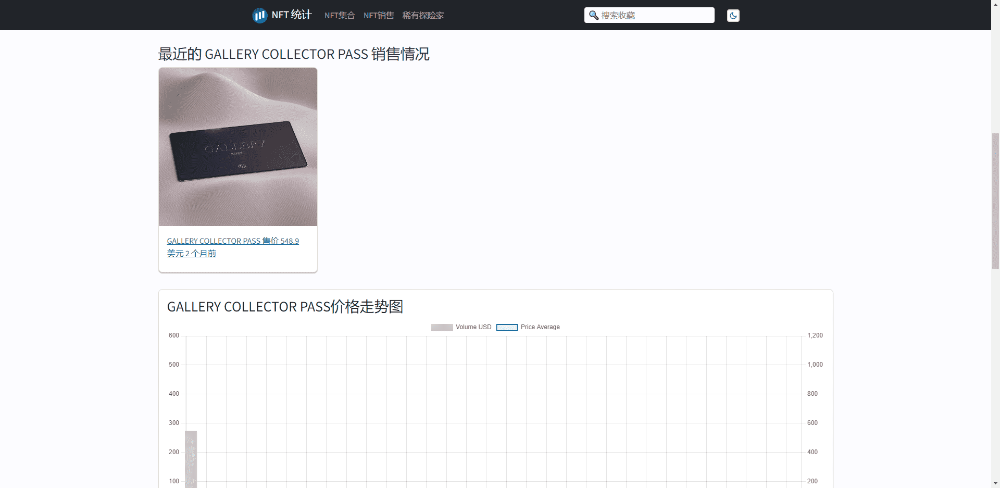

# GALLERY COLLECTOR PASS

成为10,000人中的一员，访问web3最受欢迎的访问列表平台的收集器端。

什么是画廊收藏家通行证？

GALLERY COLLECTOR PASS 是一个 NFT（不可替代令牌）集合。存储在区块链上的数字艺术品集合。

有多少 GALLERY COLLECTOR PASS 代币？

总共有 1 个 GALLERY COLLECTOR PASS NFT。目前 6 位所有者的钱包中至少有一个 GALLERY COLLECTOR PASS NTF。

最昂贵的 GALLERY COLLECTOR PASS 销售是什么？

最昂贵的 GALLERY COLLECTOR PASS NFT 是 GALLERY COLLECTOR PASS。它于 2022-06-30（2 个月前）以 548.9 美元的价格售出。

最近卖出了多少 GALLERY COLLECTOR PASS？

过去 30 天内售出了 1 个 GALLERY COLLECTOR PASS NFT。

