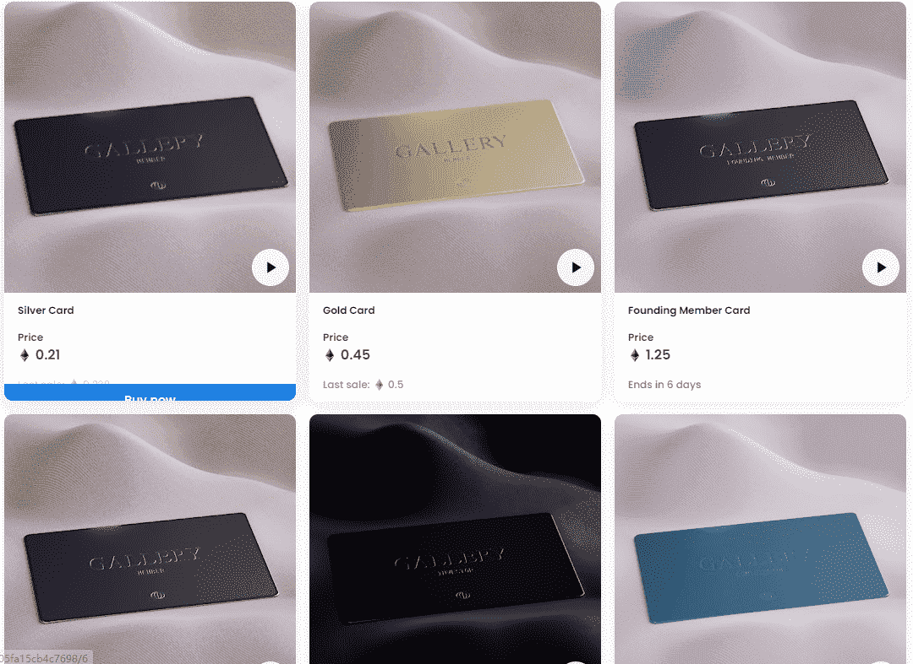

# Gallery Membership Cards

什么是画廊高级会员卡？

Gallery Premium Membership Cards 是一个 NFT（不可替代代币）系列。存储在区块链上的数字艺术品集合。

画廊高级会员卡代币有多少？

总共有 8 张画廊高级会员卡 NFT。目前，1,084 位所有者的钱包中至少有一张画廊高级会员卡 NTF。

最昂贵的画廊高级会员卡销售是什么？

出售的最昂贵的画廊高级会员卡 NFT 是 银卡。它于 2022-08-01（29 天前）以 408 美元的价格售出。

最近卖出了多少张画廊高级会员卡？

过去 30 天内售出了 6 张画廊高级会员卡 NFT。

