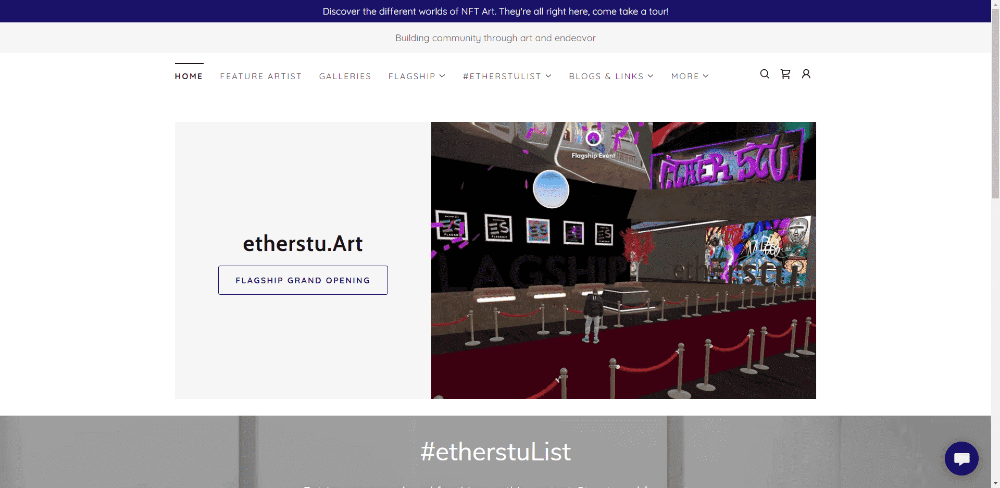

# etherstu.Art Gallery Keys

你有没有问过...

为什么建筑设计总是遵循物理定律？

谁说城市需要沿着同一个地平面存在？ 

为什么我从电梯里出来的每一层的天气都不能改变？

如果像我们大多数人一样，您长期以来一直需要这些答案......

欢迎来到不一样的东西。

每一层都是开阔的天空，可以添加任何环境。

夏天，冬天，白天，黑夜，天堂，还是……地狱？每层都有惊喜！

