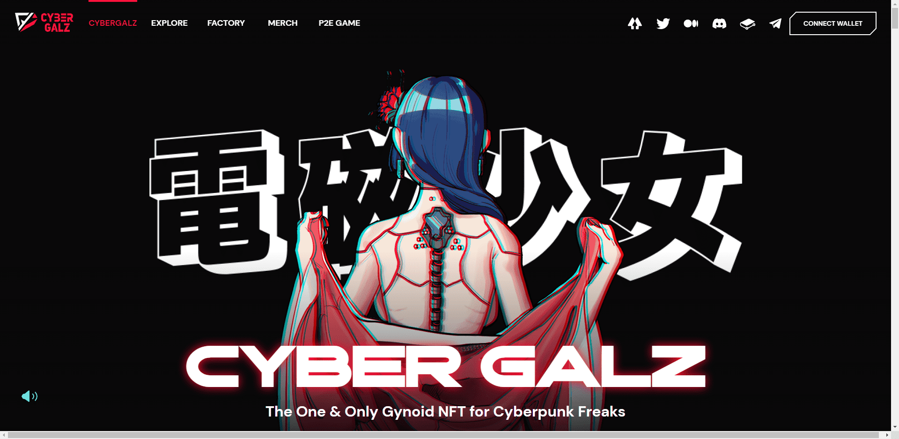

# Cyber Galz - Galz

Cyber Galz 是来自公元 2136 年未来的全能女性类人生物，比比特币减半早了四年。除了他们出色的表现——包括处理能力、战斗能力、虚拟世界中的功能实用程序和算力，每个 Galz 都拥有魅力，让他们的主人为拥有它们而自豪。

Cyber Galz NFT 是随机生成的四个固定属性和五个可变属性的组合，这使得每个 Galz 都是一个真正独立且独特的 NFT。

由于 NFT 是在 Immutable X、以太坊第 2 层协议上开发的，Galz 的主人可以零 Gas 费更改他们的 Galz NFT 项目。

Galz 的主人可以通过添加、删除和更改可变属性，使他们的 Galz 成为一个自我启发的独特 NFT。

NFT 数据将存储在领先的 IPFS 桥接系统 Arweave 去中心化存储中。这种技术采用提高了数据的可靠性并提供了功能稳定性。

