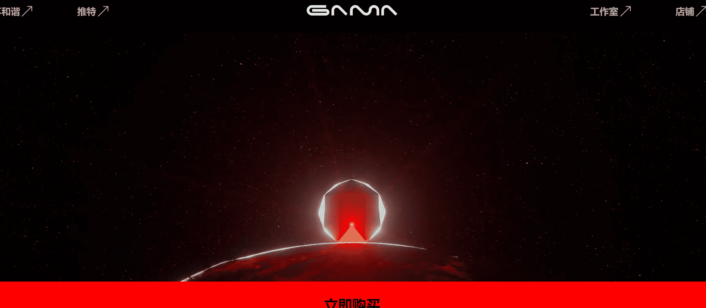

# GAMA SPACE STATION

项目网站、社交联系方式、项目介绍内容详见：

GAMA SPACE STATION 是一个 NFT（不可替代代币）集合。存储在区块链上的数字艺术品集合。总共有 9,999 个 GAMA 空间站 NFT。目前 830 位车主的钱包中至少有一个 GAMA SPACE STATION NTF。

售出的最昂贵的 GAMA SPACE STATION NFT   它于 2022-06-05（3 个月前）以 545.9 美元的价格售出。

