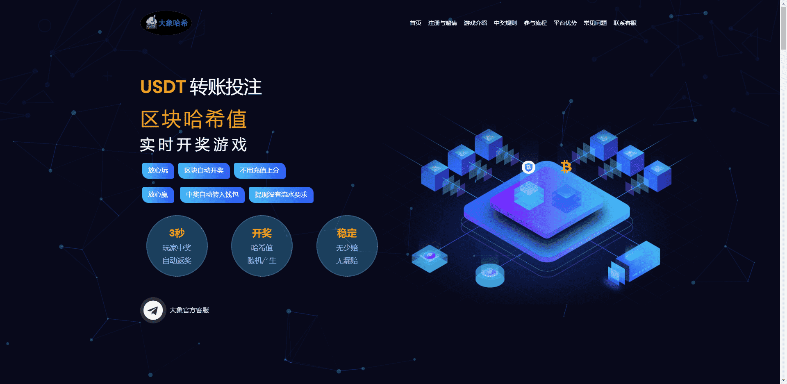

# GameboyKoda

去中心化钱包的数据都是区块链上的数据，而中心化钱包的数据则依赖钱包服务商自己的账本
举个例子：
我们在交易所的钱包就是中心化钱包，我们往交易所指定的地址转账，然后交易所在自己的账本上记录了我们的充值记录，此后每做一次充值转账，交易所直接在他的账本上进行记录，这整个过程完全没有发生在区块链上。
因此我们需要注册一个属于自己的去中心化钱包

玩家向平台数字钱包地址转账[投注]

开奖结果采用[转账的区块哈希值]

立即开奖判定输赢，玩家中奖盈利

3秒将[本金+盈利]自动转玩家钱包地址

不下载APP不用注册充值操作方便开奖公平

区块哈希值是一段数据的DNA

每个区块哈希值都是唯一的、随机的且不可破解的

哈希值是区块链技术不可变的和确定的潜力核心基础

保留了记录和查看的数据的真实性

以及区块链作为一个整体的完整性

完全随机生成不可操控篡改

