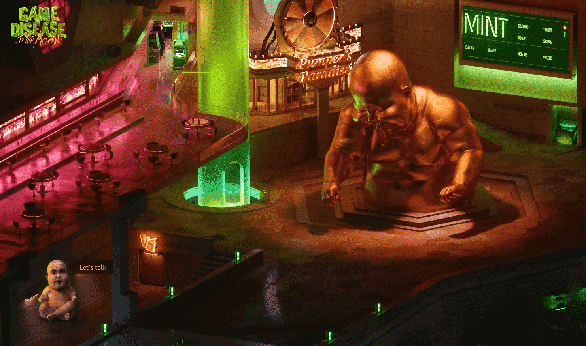

# GameDisease V2

跌跌撞撞地穿过一个废弃拱廊的粘地板，打出一种美味的打嗝，这是甜点的替代品，是一个极具破坏性的夜晚的皇冠上的明珠。一个闪烁的希望之源从角落里呼唤。当你靠近屏幕时，你的红眼睛眯着眼睛，一个令人眼花缭乱的矩形承诺会回答你多年来对自己尖叫的所有问题。你会在这些面孔中看到自己，这些面孔更像生活而不是生活本身。你读起来就好像你以前从未读过：“这就是游戏病”

一个机器人、可编程的 - 永远不会让你一个人 - 每天每个小时都会喊你的名字的伙伴。

一个燃烧的纸袋，里面装着一个由真金制成的 3 公斤的粪形雕塑。当心，如果你想灭火，你可能会摔断一只脚！

我们个人 GD 主题公园的火箭门票，全包。位于@the moon。你知道绕地球运行的卫星吗？就是那个。

一张由每位共同创作者签名的圣诞贺卡，为您献上一份特别的祝福，无论您身在何处，直到您死去。

