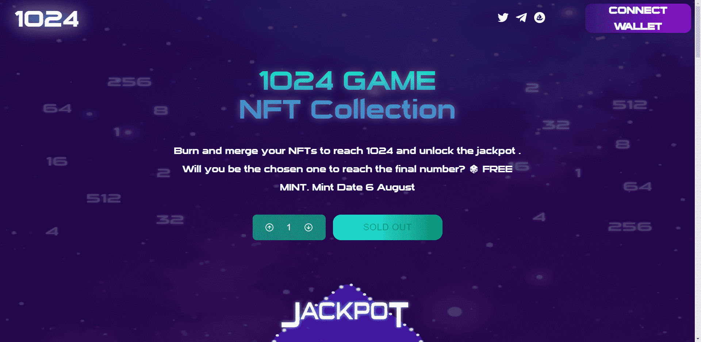

# GAMENFT1024

受流行游戏 2048 的启发，1024 是一个独特的社会实验，旨在影响和研究纸和钻石手之间的因果关系。他们会合作还是互相宣战？

每次合并成本 0.042，您只能将重复项合并在一起（1 + 1 = 2、2 + 2 = 4...）

这个项目不以任何形式或形式与游戏合作或附属。但是我们确实玩了很多小时

我们决定为活跃和忠诚的社区成员添加 8 个 8 号 NFT。这是为了保证和增加达到1024的概率。

用户的特权和用例将根据他在游戏中的数量而发展。谁知道这些数字能保留什么样的惊喜呢？

