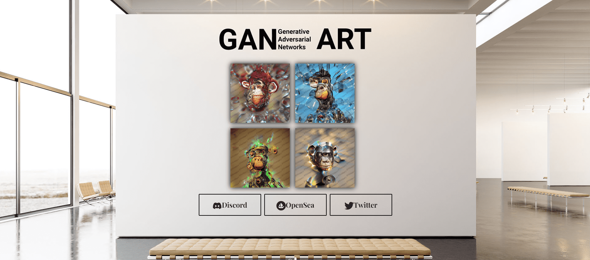

# GAN APES

生成式对抗网络是一类机器学习框架。
本质上，两个大型数据集（图像、音频、视频）等是无人监督的，可以相互“学习”或“训练”。
培训课程结束后，将创建一个文件，其中包含培训期间所学内容的风格。这个文件可以被认为是 ai 或 GAN 的“大脑”，因为如果被引导，它可以生成与训练集风格相同的新图像或视频或歌曲，通常使用具有高 vram 或 eth 的现代 gpu挖矿设备算力渲染。

这些 NFT 没有稀有图表，因为它们是无与伦比的。由观察者决定它们的价值。

在生成对抗网络 (GAN) 的帮助下，我们能够创造出超出人类想象的独特艺术品。我们的第一个出版物——GAN Apes——是从整个原始 BAYC 图像数据库中训练出来的，结果非常好，我们收到了来自社区甚至一些 BAYC 持有者自己的良好反馈，这激励我们更加努力地工作。
GAN 是 NFT -（非同质代币），以太坊区块链上的数字化艺术。
通过利用 NFT (ERC-721) 和 IPFS 技术，我们能够创造出永恒的艺术。拥有我们的 NFT 也意味着您拥有原始艺术品及其全部权利。

