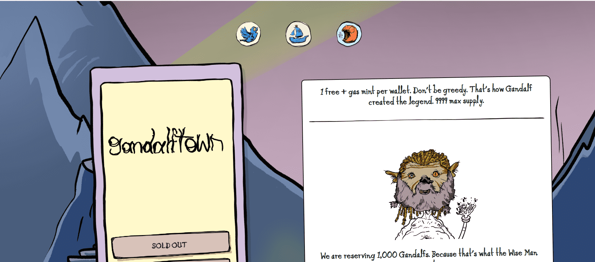

# gandalftown.wtf

▶ 什么是 gandalftown.wtf？
gandalftown.wtf 是一个 NFT（非同质代币）集合。存储在区块链上的数字艺术品集合。
▶ 有多少 gandalftown.wtf 代币？
总共有 9,292 个 gandalftown.wtf NFT。目前，5,596 位业主的钱包中至少有一个 gandalftown.wtf NTF。
▶ 最昂贵的 gandalftown.wtf 销售是什么？
最昂贵的 gandalftown.wtf NFT 是 GandalfTown #8958。它于 2022-06-06（3 个月前）以 34.5 美元的价格售出。
▶ 最近卖出了多少 gandalftown.wtf？
过去 30 天内售出了 808 个 gandalftown.wtf NFT。
▶ gandalftown.wtf 需要多少钱？
在过去 30 天内，最便宜的 gandalftown.wtf NFT 销售额低于 9 美元，最高销售额超过 22 美元。过去 30 天，gandalftown.wtf NFT 的中位价格为 16 美元。
▶ 什么是流行的 gandalftown.wtf 替代品？
许多拥有 gandalftown.wtf NFT 的用户也拥有 Cheebs NFT、 I'm Tired NFT、 BOOMING和 ApexWolves NFT。

