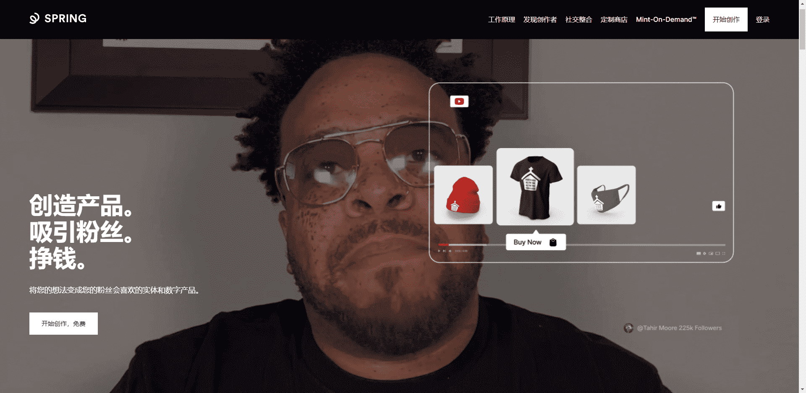

# Gang Goods

我们相信，创作者是任何有想法和观众可以与之分享的人，世界需要更多的人。我们的存在是为了支持这些创作者，提供他们将想法变为现实所需的一切。

我们所有的产品和服务都经过一系列质量保证检查，以确保为创作者及其粉丝提供最佳体验。所有供应商都被要求遵守涵盖健康和安全法规、劳工和人权法以及道德商业惯例的道德行为准则。我们优先考虑提供环保产品或使用减少环境影响的做法的供应商

在 Spring 上创建，然后通过您的社交渠道无缝地提供您的产品。让您的粉丝准确地在他们消费您的内容的地方购物。

在您自己的商店中销售产品，优化转换并反映您作为创作者的身份。连接自定义域并在几分钟内准备好进行推广。

即时定制超过 180 种实体产品、销售数字下载、启动 NFT 或创建您能想到的任何定制产品。您创造，我们将负责实现和端到端的粉丝体验。

