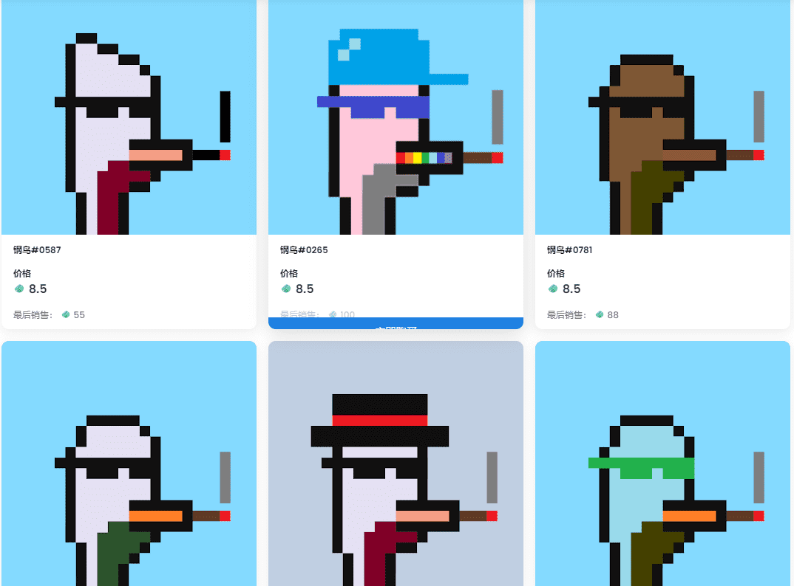

# GANGBIRDS V2

SEMOCRYPTO 开发了一种智能合约，该合约已经过改进以跟上本次 NFT 上市中 Klaytn 费用的增加，并且无论存入 NFT 的数量如何，都将费用从 0.08 KLAY 显着提高到 0.09 KLAY，固定费用。如果您能期待 NFT 项目在未来上市，我们将不胜感激。

KLAYONG的NFT充值服务已经开通。我们期待您的参与和支持。

介绍 Semo Crypto 的新合作伙伴，Electrik Finance。 Electrick .finance 是一个通过提供所有 Klaytn DEX 复利存款和用户友好服务来发展业务的团队。金库池存款活动将于 4 月 4 日至 4 月 17 日持续 2 周

