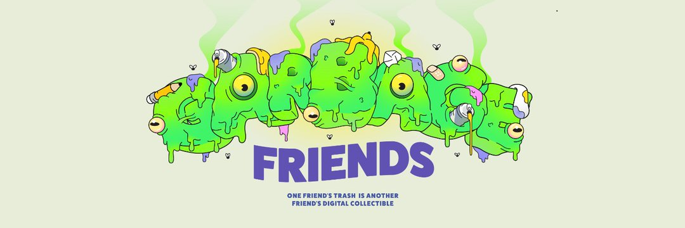

# Garbage Friends Meta

Garbage Friends 是一个 NFT（非同质代币）集合。存储在以太坊区块链上的数字艺术品集合。数字艺术品是以数字化形式存在的形象化表现客观事物和\或表达主观思想的具有较高审美/艺术水准的视觉或视听作品。

数字艺术品的核心技术最重要的价值在于能够对其进行标记生成唯一数字凭证，并且不能被篡改、复制，同时数字艺术品的交易信息会通过智能合约记录存储在「区块链」上，实现可信追溯，有效保护发行者版权和消费者权益。

除此之外，数字艺术品让艺术收藏更加平民化，让更多的人能成为数字艺术品的收藏家，还不会有实物艺术藏品储存和流通的烦恼，让艺术藏品得以永恒。

