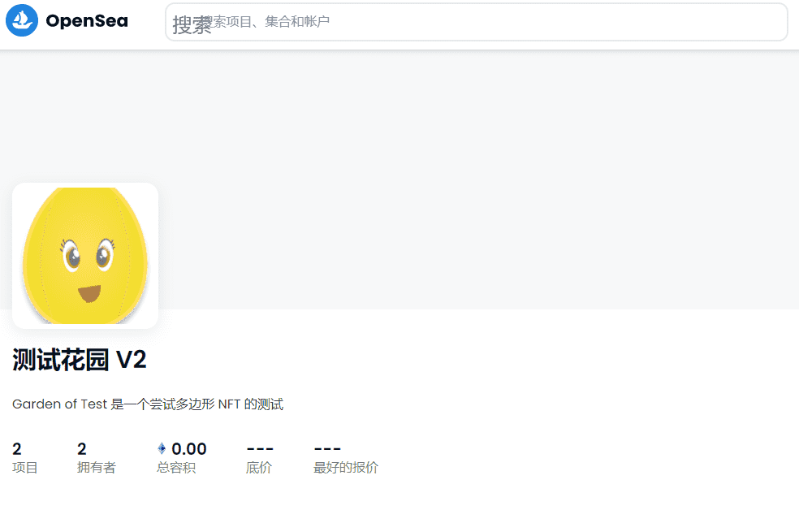

# Garden of Test V2

▶ 什么是测试花园 V2？
Garden of Test V2 是一个 NFT（Non-fungible token）集合。存储在区块链上的数字艺术品集合。
▶ 测试花园 V2 代币有多少？
总共有 2 个测试花园 V2 NFT。目前有 2 位所有者的钱包中至少有一个 Garden of Test V2 NTF。
▶ 测试花园V2最近卖出了多少？
过去 30 天内售出 0 个测试花园 V2 NFT。

