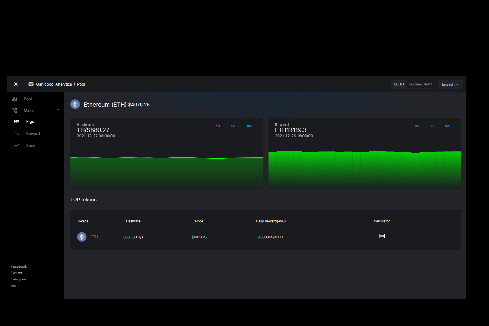

# Garlicpool

我们是匿名的，不要任何注册，您只需要连接去中心化钱包和计算力参与计算和处理区块，我们会协助参与者生成和发现新的区块，并提供工作量共识证明，分配出块奖励。解锁钱包解锁钱包。选择一个钱包。解锁钱包。以太坊（ETH）。1237.39 美元。算力。TH/S855.22。2022-7-7 10:00:00。1D3D1M。报酬。ETH13078.5。*Garlicpool* dApp：*Garlicpool*是一个完全去中心化的挖矿网络。它在以太坊区块链上运行。查看完整分析！在 Medium 上阅读*Garlicpool* .eth 的文章。每天，*Garlicpool* .eth 和数以千计的其他声音在 Medium 上阅读、写作和分享重要故事。

