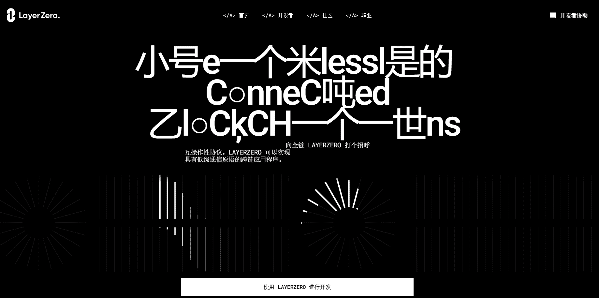

# Gas LayerZero

LayerZero 是一种全链互操作性协议，专为跨链传递轻量级消息而设计。LayerZero 通过可配置的不信任提供真实且有保证的消息传递。当 UA 将消息从链 A 发送到链 B 时，消息通过链 A 上的端点进行路由。然后端点通知 UA 指定的 Oracle 和 Relayer 消息及其目标链。Oracle 将区块头转发到链 B 上的端点，然后 Relayer 提交交易证明。证明在目标链上得到验证，消息被转发到目标地址。

