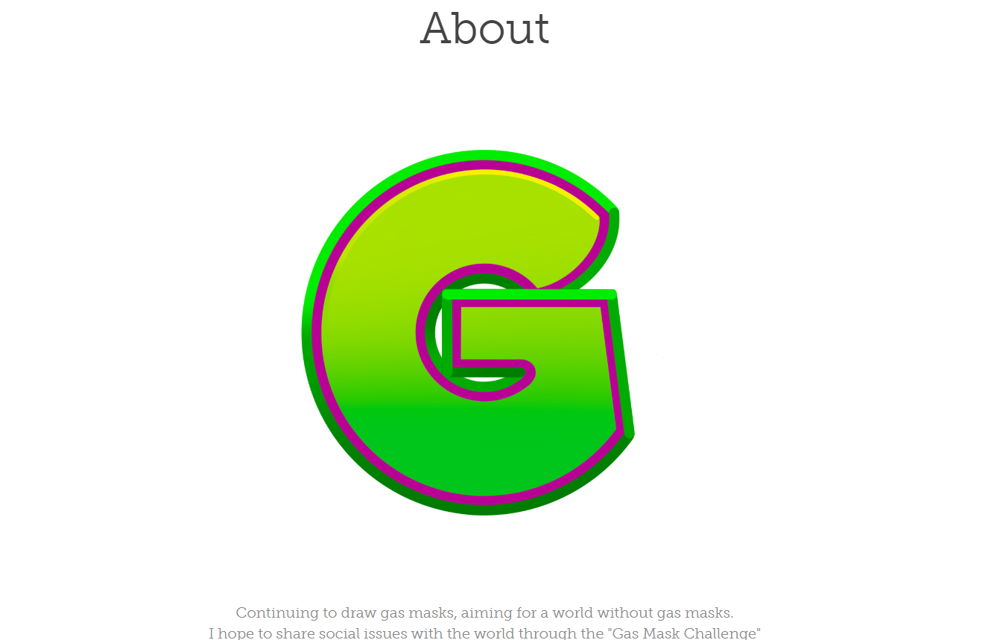

# Gas Mask Challenge

继续画防毒面具，瞄准没有防毒面具的世界。
我希望通过“防毒面具挑战”与世界分享社会问题

很高兴见到你！
我是加密艺术家 Kazuma Ono。

我想与您分享我对这个项目的想法，无论多么简短。

为了我自己的孩子，我开始了这个项目。
尤其是这几年，世界上的问题越来越明显，我开始担心自己孩子的未来，这是导火索。

我画了很多带着防毒面具的人物来分享病毒、气候变化和人权等世界问题。
我也相信通过使用 NFT，我可以继续以一种更加分散和持久的方式与世界分享这个问题。

我一个人能做的很少，但我相信当这个项目最终作为一个 DAO 发挥作用时，防毒面具将被世界公认为一个积极的图标，成为孩子们未来的光明希望。

我希望这对你感兴趣！

