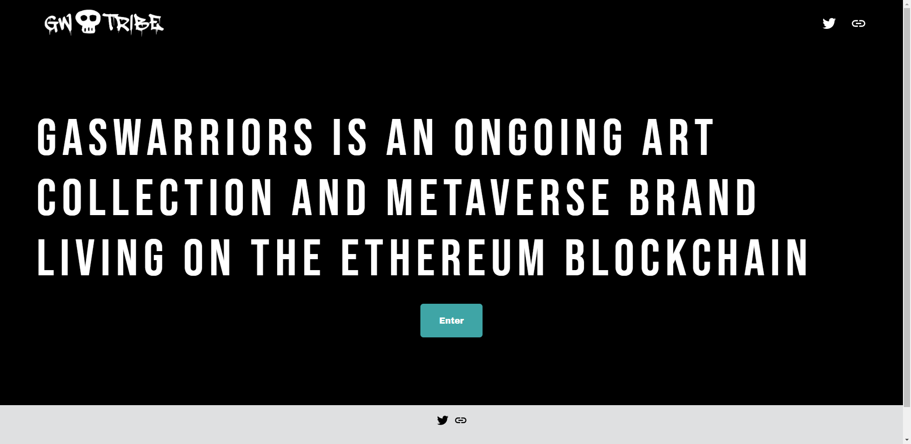

# GasWarriors Clones

GasWarriors Clones 是 8,888 个独特的数字化身 NFT 的集合，它们在以太坊区块链上为生存而战。这些穿越时空的战士由超过 200 种手绘特征生成，每一个都具有可验证的独特性。Free to Mint，由活跃的社区和已建立的 1/1 艺术项目推动，这些勇士代表 NFT 社区价值观。

GasWarriors 是一个持续的艺术收藏品和虚拟世界品牌，生活在以太坊区块链上

区块链上的永生。这就是承诺。随着元宇宙日复一日地渗入我们的现实，也许所有的艺术都会以这种方式被消耗掉。2021 年 6 月将是记忆的东西，传奇的东西。传奇的地位来之不易……这些作品由两个战士的灵魂组成，代表了对部落忠诚和信仰的奖励。右上角编号表示混合动力车，这些作品被空投给符合条件的收藏家。在风格上与他们所代表的勇士相似，这些作品乞求被 HODL'd ......在我们现在发现的这个世界上，还有什么比金色面具更能说明“传奇”？不多。

