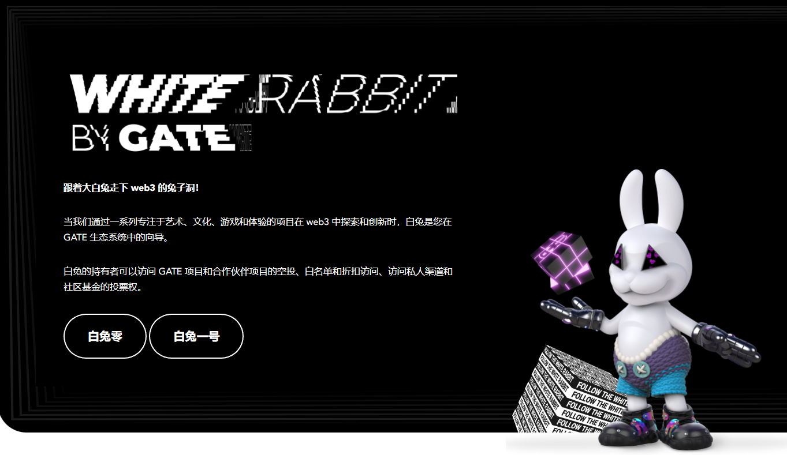

# GATE Artifacts

GATE 是一家 web3 公司，与社区一起构建 Metaverse 的构建块 - 角色、物品、艺术和体验。GATE 的精神围绕着创新、包容、实用、价值和乐趣！

GATE Artifacts 是 GATE 生态系统中实用程序和访问令牌的集合。

当我们深入元界的兔子洞时，白兔是您的向导。跟着白兔子！

当我们通过一系列专注于艺术、文化、游戏和体验的项目在 web3 中探索和创新时，白兔是您在 GATE 生态系统中的向导。

白兔的持有者可以访问 GATE 项目和合作伙伴项目的空投、白名单和折扣访问、访问私人渠道和社区基金的投票权。

