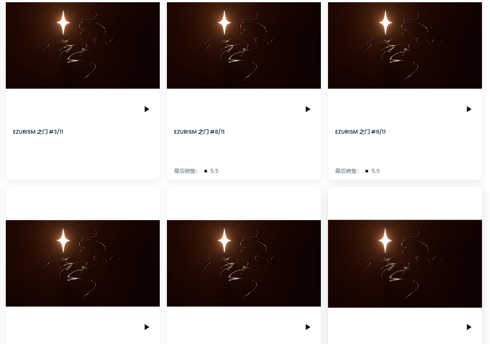

# GATE TO EZURISM

EZURISM 之门。一个向好奇的人展示其奇迹的门户。

什么是通向 EZURISM 的大门？

GATE TO EZURISM 是一个 NFT（不可替代令牌）集合。存储在区块链上的数字艺术品集合。

存在多少 GATE TO EZURISM 代币？

总共有 11 个 GATE TO EZURISM NFT。目前，11 位所有者的钱包中至少有一个 GATE TO EZURISM NTF。

永久纸像素融合,科学艺术，艺术科学。灰烬收集者和创作者 / 草图 / 版画 / VJ 

