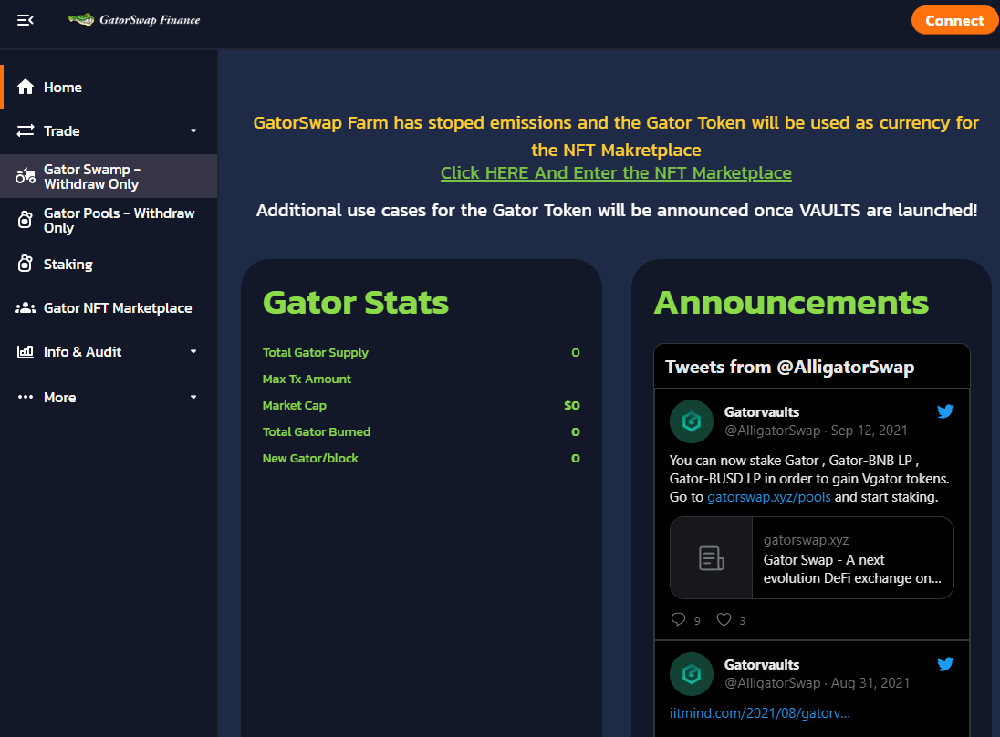

# Gatorswap finance

BSC 上最好的 AMM、Yield Farm 和 Dex。
自动流动性 Gator 的每次转让必须缴纳 7% 的转让税。 5.6% 的转让税通过合约自动添加到流动性池中，以不断提高价格下限。流动性将被锁定且无法访问。
自动燃烧正如我们上面提到的，Gator 的每次转让都必须缴纳 7% 的转让税。 5.6% 的转让税将分配给自动流动性获取。剩下的1.4%的转让税将立即被烧掉。整个过程是自动的。
Harvest Lockup Harvest lockup 是一种独特的奖励锁定机制，用于限制收获的频率。它旨在防止农业套利机器人不断收获和倾销。Anti Whale Transfer 超过总供应量的 0.5% 将被拒绝。随着总供应量的增加，这个比例会降低。
存款费用重新分配 当用户在 GatorSwap 上对非本地货币对进行质押时，将收取 4% 的存款费用，但与其他收益农场不同，我们不打算使用存款费用回购和销毁。这是浪费钱。相反，我们会将 3% 的存款费用重新分配给 Gator 持有者以鼓励持有。
推荐计划 已实施链上推荐计划，以激励用户邀请朋友加入农场。邀请者可以永久赚取他/她朋友收入的 5%。
无迁移者代码 MasterChef 合约中的迁移者代码已被删除。Timelock 已在启动时添加 Timelock。Trading Incentive

