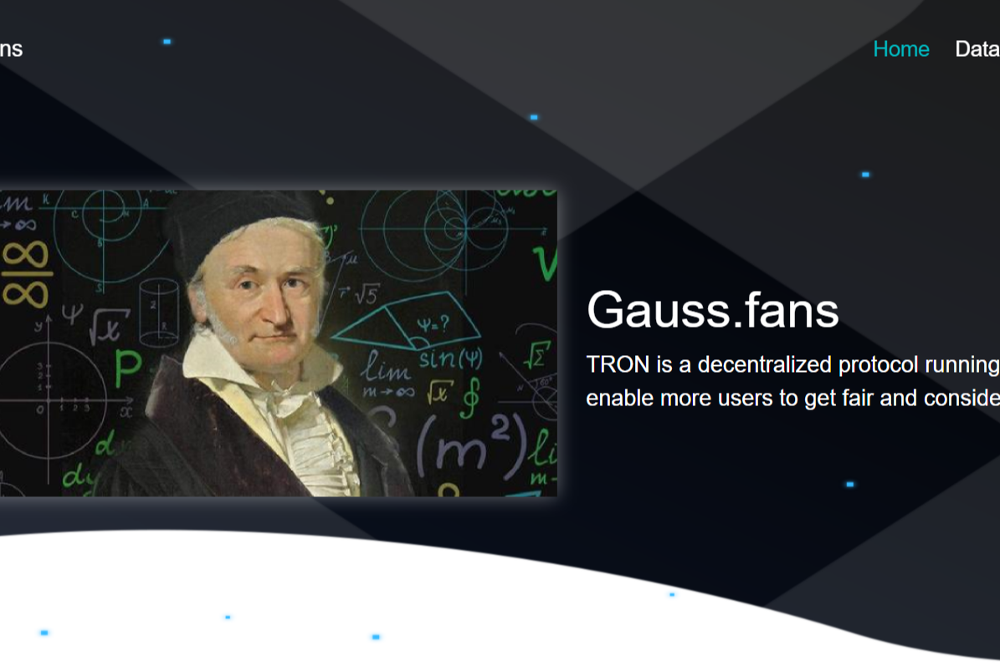

# GaussFans

Gauss 是运行在 TRON 网络上的去中心化协议。其目的是让更多的用户在该协议中获得公平且可观的双重收益。StableFund - 使用我们的 AI 交易机器人赚取 1.5% 的奖励 - 立即质押！打开 Dapp。*高斯范*。＃... 一般来说。#... 在 DeFi 中。#...在波场。打开 Dapp。打开 Dapp。Gauss 是运行在 TRON 网络上的去中心化协议。其目的是让更多的用户在这个首席执行官。首席执行官兼总裁 Christian Deutinger 首席执行官兼创始人 Christian Deutinger。出生日期：1972 年 11 月 20 日出生地：德国巴伐利亚州慕尼黑

