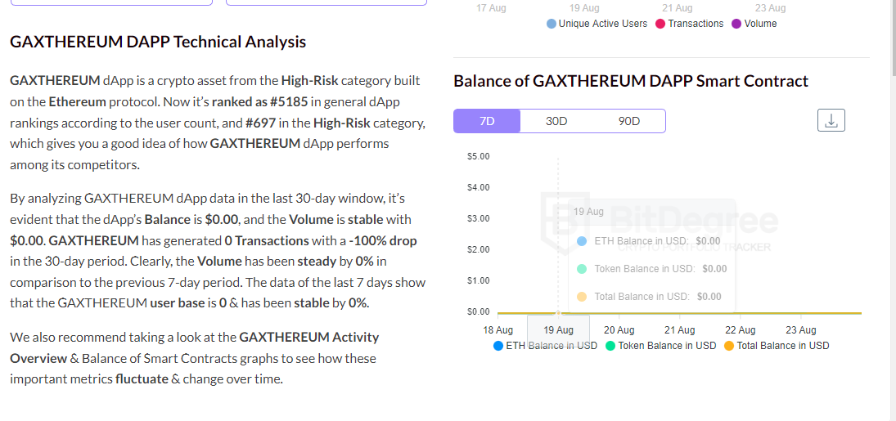

# GAXTHEREUM

以太坊爱好者贡献ETH并分享给他人获得*GAXTHEREUM*统计数据；用户。- · Dapp用户排行榜；交易。- · Dapp 交易图表；体积。$0 · Dapp 成交量图表；平衡。$0 · Dapp 余额图表。*GAXTHEREUM*基于以太坊区块链。该平台是一种投资项目。它允许您投资您的以太币，并获得被动...*嘉士腾*。*嘉士腾*。供以太坊爱好者贡献ETH并与他人分享以获得奖励。启动 DApp 访问网站。平台以太坊。*以太坊*是一种技术，它是数字货币、全球支付和应用程序的所在地。社区建立了蓬勃发展的数字经济，大胆的新方式...*以太坊*是具有智能合约功能的去中心化开源区块链。以太币（ETH 或 Ξ）是平台的原生加密货币。

