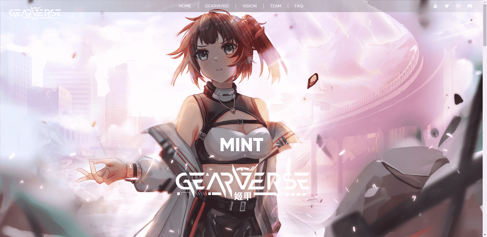

# GearverseOfficial

旧历2070年，神秘的异次元生命突然飞到地球，人类濒临灭绝。幸存的人类为了对抗敌人而制作了武器化的战斗盔甲，但只有女孩能够控制装备。这种机甲技术很快传遍了大地，全世界的女孩子都开始武装起来反击。

齿轮ArtverseGear Artverse是一个为有才华的艺术家、收藏家和艺术爱好者提供的在线平台，其主要目标是在他们之间建立新的体验，允许用户在一个紧密联系的社区中加入和与其他艺术收藏家和创作者的网络。我们将开发两个函数来为Gear Artverse奠定基础。1.齿轮画廊齿轮画廊作为一个亚文化的桥梁，连接艺术家和收藏家毫不费力，它是鼓励艺术家创造独特的NFT艺术，使他们通过元世界接触到更大的观众。参观者也可以进入这个3D空间，在这里他们可以自由移动，比以往任何时候都更密切地互动，并吸收展出的作品的感知和影响。2.艺术的请求如前所述，我们的平台旨在为我们的用户带来新的体验，连接艺术家、收藏家和艺术爱好者。齿轮Artverse生态系统将包括不止一个展示柜，我们将添加一个艺术请求功能。这是一个功能，允许用户搜索我们的艺术家持有人，并促进艺术请求完全。它旨在为创作者和粉丝提供一个享受创意活动的地方，而不是一个要求工作的地方，所以如果收藏家或艺术爱好者想要一幅画或1/1的NFT艺术作品，这是一个正确的地方

